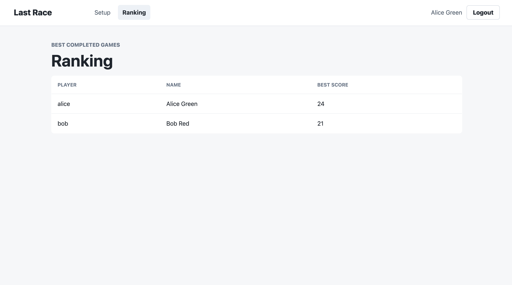
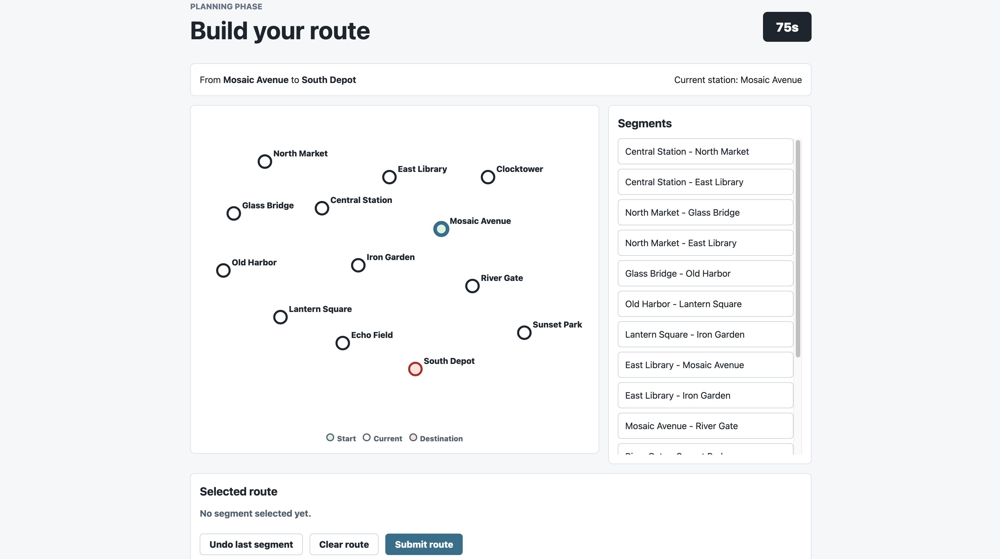

# Exam #1: "Last Race"

## Student: s352344 MOLINARO FELICE

## React Client Application Routes

- Route `/`: public home page containing the game instructions. It shows a link to the setup page for authenticated users and a login link for anonymous visitors.
- Route `/login`: login form for registered users. An already authenticated user is redirected to `/setup`.
- Route `/setup`: protected setup page showing the complete underground network, including stations, connections, lines, and their colors. The user can start a new game from this page.
- Route `/ranking`: protected page showing the best score obtained by each user.
- Route `/games/:gameId/planning`: protected planning phase for game `gameId`. It shows stations without metro lines, the assigned endpoints, all network segments, the selected route, and the 90-second timer.
- Route `/games/:gameId/execution`: protected execution phase for game `gameId`. It reveals one route segment and its randomly selected event at a time.
- Route `/games/:gameId/result`: protected result page for game `gameId`. It shows the final score, the possible failure reason, and links to start another game or view the ranking.
- Route `*`: fallback page displayed when no other client route matches.

## API Server

- GET `/api/instructions`
  - Public API with no parameters. It returns the game title and an array of instruction strings.
- POST `/api/sessions`
  - Public login API. The request body contains `username` and `password`; on success it returns the authenticated user object `{ id, username, name }` and creates a session cookie.
- GET `/api/sessions/current`
  - Returns the currently authenticated user object. It returns `401` when no valid authenticated session exists.
- DELETE `/api/sessions/current`
  - Protected logout API with no body. It closes the current Passport session and returns `204 No Content`.
- GET `/api/network`
  - Protected API returning the complete network: stations, metro lines with their ordered stations, and segments with the identifiers of the lines serving them.
- POST `/api/games`
  - Protected API that creates a game for the authenticated user. It returns the new game with random start and destination stations at least three segments apart and its planning deadline.
- GET `/api/games/:id/planning-data`
  - Protected API returning game `id` and the planning network. The network contains stations and segment endpoints but does not expose metro lines or segment line identifiers.
- POST `/api/games/:id/route`
  - Protected API receiving `{ route: [{ from, to }, ...] }`. It validates and stores the route, returning either the execution information or a failed result with score zero and its reason.
- GET `/api/games/:id/execution`
  - Protected API returning the execution state: game data, number of route steps, previously revealed events, and current coins.
- POST `/api/games/:id/execution/next`
  - Protected API that reveals the next segment of the route, randomly selects an event, updates the coins, and returns the revealed step and completion information.
- GET `/api/games/:id/result`
  - Protected API returning the completed or failed game, including its final score and possible failure reason.
- GET `/api/ranking`
  - Protected API returning at most ten users, ordered by their best completed or failed game score.

## Database Tables

- Table `users`: registered users, with unique username, display name, password salt, and password hash.
- Table `stations`: underground stations, with unique name and coordinates used to draw the map.
- Table `metro_lines`: metro lines, with unique name and display color.
- Table `line_stations`: association between lines and stations. The `position` field records the order of stations along each line.
- Table `events`: possible journey events, with their description and integer coin effect between -4 and +4.
- Table `games`: games created by users, including assigned endpoints, status, coins, selected route, planning deadline, final score, timestamps, and possible failure reason.
- Table `game_events`: events revealed during game execution, with step index, segment endpoints, selected event, and resulting coin total.

## Main React Components

- `App` (in `client/src/App.jsx`): stores the authenticated user, checks the current session, manages logout, and defines all React Router routes.
- `Navigation` (in `client/src/components/Navigation.jsx`): application header with navigation links, authenticated user information, and login/logout controls.
- `NetworkMap` (in `client/src/components/NetworkMap.jsx`): reusable SVG map that draws stations, lines, segments, endpoints, current station, and the selected route.
- `HomePage` (in `client/src/pages/HomePage.jsx`): retrieves and displays the public game instructions.
- `LoginPage` (in `client/src/pages/LoginPage.jsx`): controlled login form that authenticates the user through the API.
- `SetupPage` (in `client/src/pages/SetupPage.jsx`): loads the complete network and lets the user create a new game.
- `PlanningPage` (in `client/src/pages/PlanningPage.jsx`): manages route construction, segment selection, the countdown, automatic submission, and manual submission.
- `ExecutionPage` (in `client/src/pages/ExecutionPage.jsx`): reveals journey events one at a time and updates the displayed coin total.
- `ResultPage` (in `client/src/pages/ResultPage.jsx`): shows the final score and the result or failure reason of a game.
- `RankingPage` (in `client/src/pages/RankingPage.jsx`): retrieves and displays each user's best result.

## Screenshots

## Users Credentials

- `alice`, password: `password`
- `bob`, password: `password`
- `carol`, password: `password`

## Use of AI Tools
As for the AI tools I used ChatGPT and GitHub Copilot. Copilot has been used mainly to auto-complete some parameters or comments and for analysing some changes suggested by the other AI. I used ChatGPT to get a general idea and a step guide to understand and organise the flow of the work and to get some help in some part of code I didn't really understand how to use or configure; the last usage of the AI was to seek any bug in the application or to suggest any upgrade in the code. 
The verifications of every change suggested was made by verifing its correctness by looking at the course's slides and by doing some manual tests on the browser.
